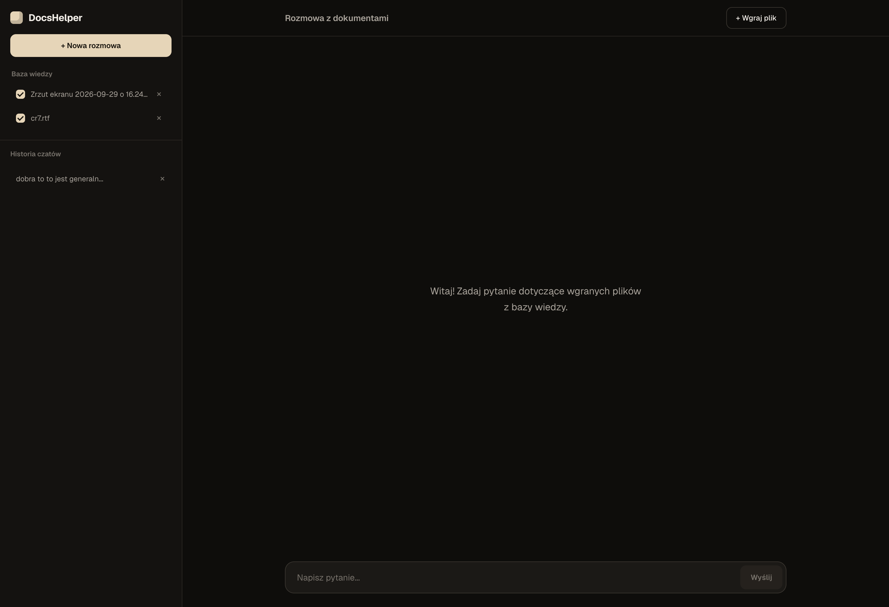

<h1>DOCSHELPER - RAG ASSISTANT</h1>

  <b>DocsHelper</b> is a lightweight, privacy-focused Retrieval-Augmented Generation (RAG) application built with Spring Boot 3.3.0 and Spring AI (1.0.0-M1). It allows users to maintain contextual chat sessions backed by their uploaded documents and multi-modal image files. The system runs completely locally using Ollama, indexing text and visual contents into a persistent PostgreSQL (pgvector) store to deliver accurate, localized responses without external API dependencies.

<h2>System Capabilities</h2>

  <b>Multi-Format Ingestion & Visual OCR:</b> Native support for text-based documents (PDF, DOCX, TXT, CSV, etc.) via Apache Tika, alongside automated image analysis (PNG, JPG, WEBP) using multi-modal LLM vision processing. 
  <b>Persistent Vector Indexing (PgVector):</b> Processes and chunks incoming documents with <code>TokenTextSplitter</code> and converts them into high-dimensional embeddings via <code>bge-m3</code> stored inside PostgreSQL using the <code>pgvector</code> extension. 
  <b>Scoped Context Retrieval:</b> Dynamic metadata filtering allows users to toggle specific active documents per session, restricting semantic search strictly to selected knowledge boundaries. 
  <b>Real-Time SSE Streaming:</b> Uses Reactive Streams (<code>Flux&lt;String&gt;</code>) to deliver low-latency, character-by-character response streaming with client-side request cancellation. 
  <b>Educational Assistant & Quiz Engine:</b> Specialized prompt engineering enables interactive single-choice quizzes, guided learning explanations, and contextual document Q&A in Polish. 
  <b>Chat State Management:</b> Automatic chat session creation, empty chat cleanup, and message history persistence backed by Spring Data JPA and PostgreSQL.

<h2>Tech Stack</h2>

  <b>Language & Framework:</b> Java 21 / Spring Boot 3.x (Spring MVC, Spring WebFlux, Spring Data JPA) 
  <b>AI Framework:</b> Spring AI 1.0.0-M1 (<code>ChatClient</code>, <code>PgVectorStore</code>, <code>TikaDocumentReader</code>, <code>TokenTextSplitter</code>) 
  <b>LLM Runtime & Provider:</b> Ollama (Local Service) 
  <b>Active Models:</b> Chat/RAG: <code>llama3.1:8b</code> | Vision/OCR: <code>llama3.2-vision</code>, <code>llava</code> | Embeddings: <code>bge-m3</code> 
  <b>Content Extraction:</b> Apache Tika 
  <b>Database & Vector Store:</b> PostgreSQL with <code>pgvector</code> extension 
  <b>Frontend:</b> Spring MVC, Thymeleaf, Native Reactive JavaScript (EventSource SSE API)

<h2>Architecture & Technical Solutions</h2>

  <b>1. Dynamic Multi-Modal Ingestion Pipeline (Text & Image Processing)</b> 
  The ingestion pipeline in <code>RagService</code> inspects incoming <code>MultipartFile</code> MIME types. Text documents are parsed using <code>TikaDocumentReader</code>, chunked via <code>TokenTextSplitter</code>, and enriched with <code>file_name</code> metadata. Image files bypass text splitters and are routed to a multi-modal vision model (<code>llama3.2-vision</code> via <code>OllamaChatModel</code>) with a structured OCR/visual prompt. The extracted text description is generated into vector embeddings using <code>bge-m3</code> and stored directly as a structured <code>Document</code> entity inside <code>PgVectorStore</code>.

  <b>2. Target-Filtered Vector Retrieval & Prompt Engineering</b> 
  Retrieval is executed dynamically on <code>askStream()</code> calls. Based on the UI document selection, a boolean filter expression (<code>FilterExpressionBuilder</code>) is built dynamically to restrict vector similarity lookups to active files inside PostgreSQL. Retrieved document snippets are combined into a system prompt enforcing Polish language constraints, Markdown formatting, strict source grounding, and structured quiz generation rules.

  <b>3. Non-Blocking Reactive SSE Streaming & Client Abstraction</b> 
  Streaming responses are built using Spring WebFlux <code>Flux&lt;String&gt;</code> over Server-Sent Events (<code>MediaType.TEXT_EVENT_STREAM_VALUE</code>). The backend streams individual response chunks to the frontend while concurrently aggregating the complete response via <code>StringBuilder</code>. Upon completion (<code>doOnComplete</code>), user and AI message pairs are transactionally written to the PostgreSQL JPA repository alongside active document metadata.

  <b>4. Responsive Single-Page UI & Execution Control</b> 
  The frontend combines Thymeleaf SSR with modern vanilla JavaScript. It manages live streaming via <code>EventSource</code>, state toggles for file context checkboxes, instant UI response aborting, and input validation to prevent empty or uncontextualized queries.

<h2>Installation & Configuration</h2>

  <b>1. Prerequisites</b> 
  Ensure you have <b>JDK 21</b>, <b>Maven</b>, <b>Ollama</b>, and <b>Docker Desktop</b> installed on your environment.

  <b>2. Setup Local Models via Ollama</b> 
  Pull the required LLM chat, vision, and embedding models in your terminal:

<pre><code>ollama pull llama3.1:8b
ollama pull llama3.2-vision
ollama pull bge-m3</code></pre>

  <b>3. Start PostgreSQL with pgvector via Docker</b> 
  Run the PostgreSQL container with the <code>pgvector</code> extension enabled:

<pre><code>docker compose up -d</code></pre>

  <b>4. Run the Application</b> 
  Build and start the Spring Boot backend using Maven:

<pre><code>mvn clean spring-boot:run</code></pre>

  Once started, navigate to <code>http://localhost:8080</code> in your browser to access the DocsHelper dashboard.

<h1>DOCSHELPER - ASYSTENT RAG</h1>

  <b>DocsHelper</b> to lekki, nastawiony na prywatność asystent typu RAG (Retrieval-Augmented Generation) zbudowany w oparciu o Spring Boot 3.3.0 oraz Spring AI (1.0.0-M1). Umożliwia prowadzenie interaktywnych rozmów z własną bazą wiedzy złożoną z dokumentów tekstowych oraz plików graficznych. Całość działa w 100% lokalnie dzięki środowisku Ollama oraz bazie PostgreSQL (pgvector), zapewniając pełne bezpieczeństwo danych bez używania zewnętrznych API.

<h2>Możliwości Systemu</h2>

  <b>Multimodalne Przetwarzanie i OCR Obrazów:</b> Natywna obsługa dokumentów tekstowych (PDF, DOCX, TXT, CSV itp.) przez Apache Tika oraz automatyczna ekstrakcja tekstu i opis wizualny obrazów (PNG, JPG, WEBP) za pomocą modeli wizyjnych LLM. 
  <b>Trwałe Indeksowanie Wektorowe (PgVector):</b> Dzielenie tekstu na fragmenty przy użyciu <code>TokenTextSplitter</code> oraz generowanie wielowymiarowych embeddingów modelem <code>bge-m3</code>, zapisywanych trwale w bazie PostgreSQL za pomocą rozszerzenia <code>pgvector</code>. 
  <b>Precyzyjne Filtrowanie Kontekstu:</b> Możliwość dynamicznego wyboru plików źródłowych dla danej rozmowy z poziomu interfejsu, co ogranicza wyszukiwanie semantyczne w PostgreSQL wyłącznie do zaznaczonych dokumentów. 
  <b>Strumieniowanie Odpowiedzi w Czasie Rzeczywistym (SSE):</b> Wykorzystanie strumieni reaktywnych (<code>Flux&lt;String&gt;</code>) do płynnego przesyłania odpowiedzi znak po znaku z możliwością natychmiastowego przerwania generowania. 
  <b>Tryb Edukacyjny i Generator Quizów:</b> Prompty systemowe wymuszają generowanie przejrzystych pytań jednokrotnego wyboru, udzielanie wskazówek oraz weryfikację odpowiedzi w języku polskim. 
  <b>Zarządzanie Historią Rozmów:</b> Automatyczne tworzenie sesji czatu, usuwanie pustych konwersacji oraz trwały zapis historii wiadomości w PostgreSQL za pomocą Spring Data JPA.

<h2>Stos Technologiczny</h2>

  <b>Język i Framework:</b> Java 21 / Spring Boot 3.x (Spring MVC, Spring WebFlux, Spring Data JPA) 
  <b>Architektura AI:</b> Spring AI 1.0.0-M1 (<code>ChatClient</code>, <code>PgVectorStore</code>, <code>TikaDocumentReader</code>, <code>TokenTextSplitter</code>) 
  <b>Środowisko LLM:</b> Ollama (Lokalna usługa) 
  <b>Aktywne Modele:</b> Czat / RAG: <code>llama3.1:8b</code> | Wizyjny / OCR: <code>llama3.2-vision</code>, <code>llava</code> | Embeddingi: <code>bge-m3</code> 
  <b>Ekstrakcja Treści:</b> Apache Tika 
  <b>Baza Danych i Magazyn Wektorowy:</b> PostgreSQL z rozszerzeniem <code>pgvector</code> 
  <b>Frontend:</b> Spring MVC, Thymeleaf, Natywny JavaScript (EventSource SSE API)

<h2>Architektura i Rozwiązania Techniczne</h2>

  <b>1. Multimodalny Pipeline Wgrywania Dokumentów i Obrazów</b> 
  Warstwa przetwarzania w <code>RagService</code> weryfikuje typ MIME przesyłanego pliku <code>MultipartFile</code>. Dokumenty tekstowe są czytane przez <code>TikaDocumentReader</code>, dzielone na chunkerze <code>TokenTextSplitter</code> i tagowane metadanymi <code>file_name</code>. Pliki graficzne trafiają bezpośrednio do modelu wizyjnego (<code>llama3.2-vision</code>) z zapytaniem OCR. Zwrócona precyzyjna transkrypcja i opis obrazu są przekształcane na wektory przy pomocy modelu <code>bge-m3</code> i zapisywane jako pojedynczy dokument w <code>PgVectorStore</code>.

  <b>2. Kontekstowe Wyszukiwanie Wektorowe i Inżynieria Promptów</b> 
  Podczas zapytania <code>askStream()</code> system buduje dynamiczne wyrażenie filtrujące (<code>FilterExpressionBuilder</code>) na podstawie plików zaznaczonych przez użytkownika. Pobrane z bazy wektorowej PostgreSQL fragmenty dołączane są do promptu systemowego, który narzuca modelowi odpowiedzi wyłącznie w języku polskim, formatowanie Markdown, ścisłe trzymanie się kontekstu oraz szablon tworzenia quizów.

  <b>3. Reaktywne Strumieniowanie SSE i Obsługa Transakcji</b> 
  Odpowiedzi generowane są asynchronicznie za pomocą <code>Flux&lt;String&gt;</code> i przesyłane do przeglądarki przez Server-Sent Events. Równolegle budowana jest pełna odpowiedź w <code>StringBuilder</code>, która po zakończeniu strumienia (<code>doOnComplete</code>) jest atomowo zapisywana razem z zapytaniem użytkownika w relacyjnej bazie danych PostgreSQL za pośrednictwem Spring Data JPA.

  <b>4. Asynchroniczny Interfejs Użytkownika z Kontrolą Generowania</b> 
  Frontend oparty na Thymeleafie i czystym JS obsługuje pobieranie odpowiedzi w czasie rzeczywistym (<code>EventSource</code>), dynamiczny zapis wybranych plików źródłowych, walidację formularza oraz opcję natychmiastowego anulowania pobierania odpowiedzi i przywrócenia zapytania.

<h2>Instalacja i Konfiguracja</h2>

  <b>1. Wymagania Wstępne</b> 
  Upewnij się, że w Twoim środowisku zainstalowane są: <b>JDK 21</b>, <b>Maven</b>, silnik <b>Ollama</b> oraz <b>Docker Desktop</b>.

  <b>2. Pobranie Modeli Lokalnych w Ollama</b> 
  Pobierz wymagane modele dla czatu, wizji oraz embeddingów:

<pre><code>ollama pull llama3.1:8b
ollama pull llama3.2-vision
ollama pull bge-m3</code></pre>

  <b>3. Uruchomienie PostgreSQL z rozszerzeniem pgvector w Dockerze</b> 
  Uruchom kontener PostgreSQL z aktywną obsługą wektorów:

<pre><code>docker compose up -d</code></pre>

  <b>4. Uruchomienie Aplikacji</b> 
  Skompiluj i uruchom aplikację Spring Boot przy użyciu Mavena:

<pre><code>mvn clean spring-boot:run</code></pre>

  Po pomyślnym uruchomieniu przejdź pod adres <code>http://localhost:8080</code> w przeglądarce, aby otworzyć panel aplikacji DocsHelper.

